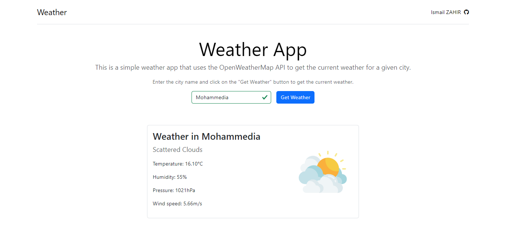

# Weather App

This is a simple weather app that uses the OpenWeatherMap API to get the current weather for a given city.



## Features

- Search for a city and get the current weather

## Technologies

- Node.js
- Express
- JavaScript
- HTML
- Bootstrap
- Axios
- OpenWeatherMap API

## Getting Started

To get a local copy up and running follow these simple steps.

### Prerequisites

- [Docker](https://www.docker.com/products/docker-desktop) (if you want to run the application in a container)
- [Node.js](https://nodejs.org/en/download/) (if you want to run the application without Docker)
- [OpenWeatherMap API key](https://openweathermap.org/appid) (required to get the weather data)

### Environment Variables

Create a `.env` file in the root of the project and add the following environment variable:

  ```bash
    cp .env.example .env
  ```

  Replace `your_api_key` with your OpenWeatherMap API key.

  ```env
  OPENWEATHER_API_KEY=your_api_key
  ```
  
### Installation

1. Clone the repository
    ```git
    git clone https://github.com/ismailza/weather-app.git
    ```

2. Navigate to the project directory
    ```bash
    cd weather-app
    ```

3. Build the Docker image
    ```bash
    docker build -t weather-app .
    ```

4. Run the Docker container
    ```bash
    docker run -p 3000:3000 weather-app
    ```
  The `-p 3000:3000` flag maps port 3000 on the host to port 3000 on the container.

The application should now be running in the Docker container.

5. Open your browser and navigate to `http://localhost:3000`

### Development Setup (without Docker)

If you prefer to run the application without Docker, follow these steps:

1. Navigate to the project directory
    ```bash
    cd weather-app
    ```

2. Install dependencies
    ```bash
    npm install
    ```

3. Start the server
    ```bash
    node app/index.js
    ```

The application should now be running at `http://localhost:3000`

## Contributing

Contributions are what make the open-source community such an amazing place to learn, inspire, and create. Any contributions you make are greatly appreciated.

## License
This project is licensed under the [MIT License](LICENCE) - see the LICENSE file for details.
